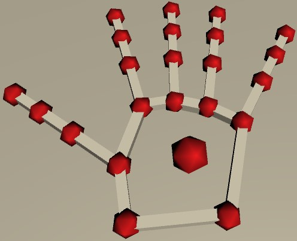
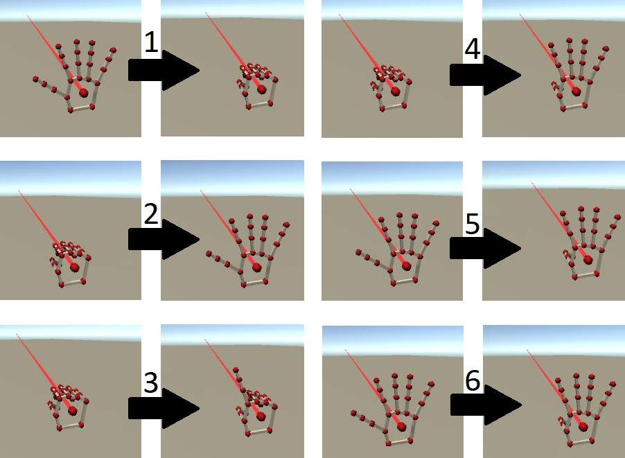
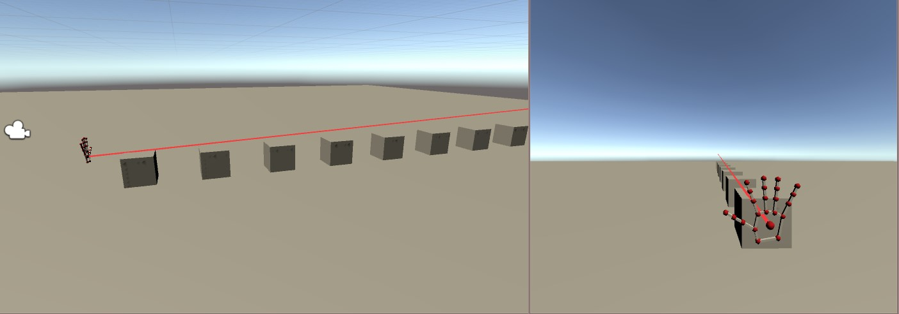
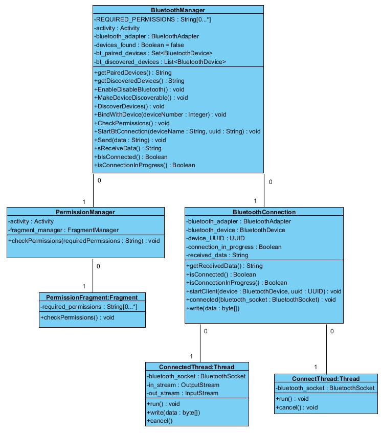
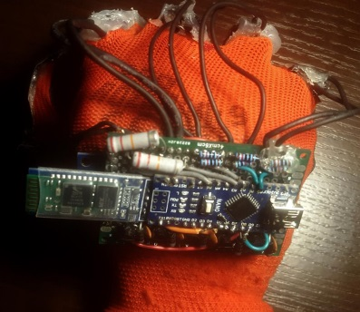
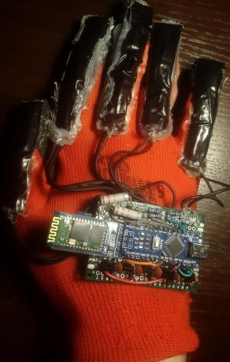

# Unity test application for controller for GEAR VR designed, constructed and implemented by me.

Controller connects with smartphone inserted in Samsung Gear Vr by Bluetooth. Controller recognize bend of the fingers and hand rotation. 

### This is how controller look like in VR test application:

### Gestures recognized by the controller:

### This is how test for precision of controller look like:

# Android Bluetooth plugin
Link for Arduino program for controller: https://github.com/Yamaraj6/GameControllerBluetoothPlugin

### Bluetooth plugin UML diagram:

# Arduino program
Link for Arduino program for controller: https://github.com/Yamaraj6/GameController_Arduino

### This is how controller look like in real world:

# Thesis
Link for thesis: https://drive.google.com/file/d/1_uHJRBcFMzxJwgoClPl3VfYrCUTJ61As/view?usp=sharing
